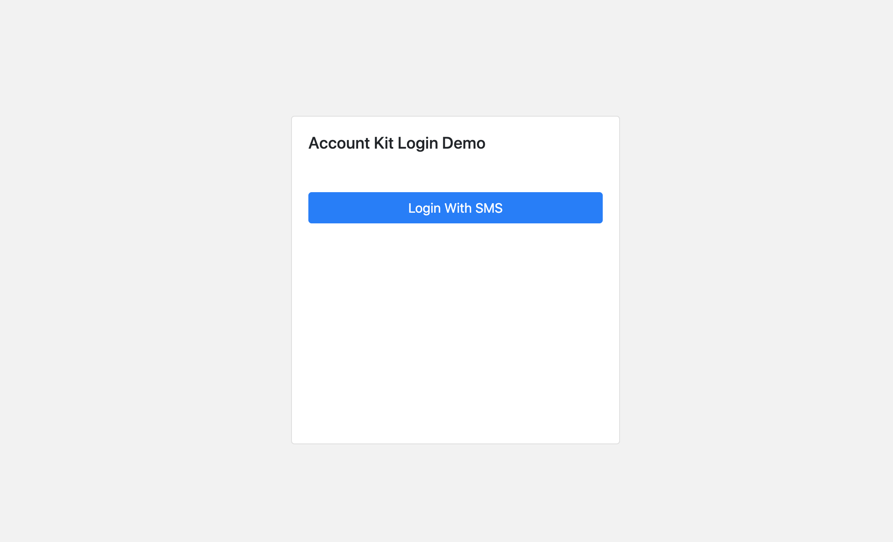
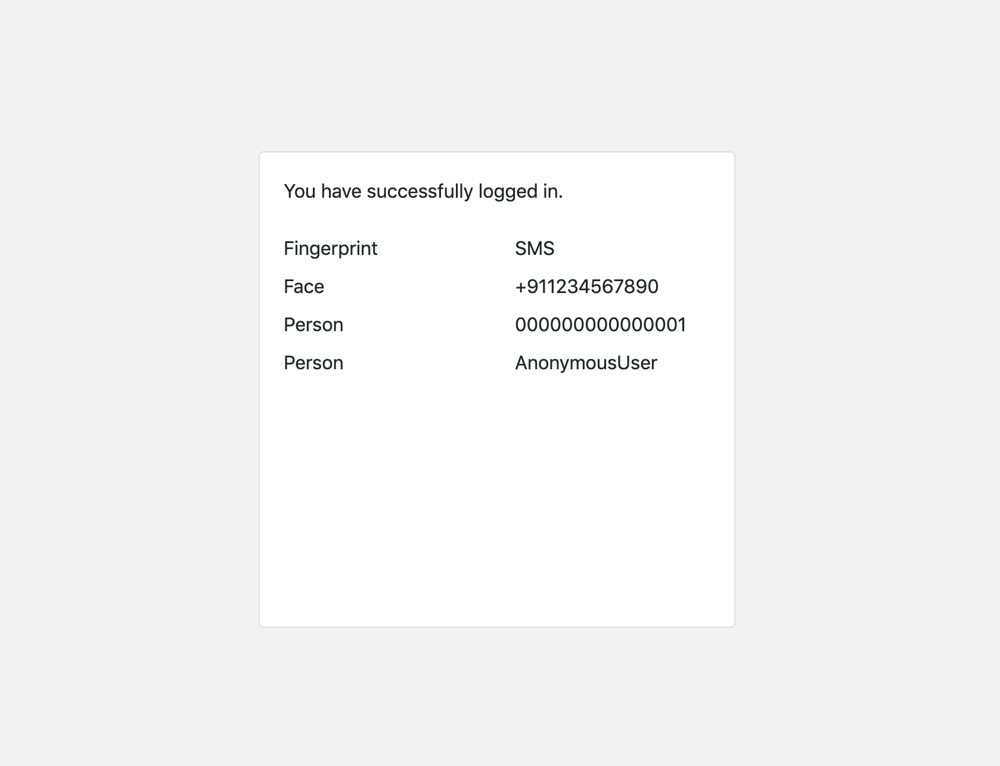

# accountkitdemo

This repo implements Facebook Account Kit using Django. Blog post can be found at https://medium.com/all-about-django/how-to-implement-passwordless-login-in-django-using-facebook-account-kit-e31a7f8a2be4

## Snaps

* Login Page



* After Login Page



## Setup Instructions

First make sure that you have the following installed.

* Python 3 and virtualenv

Now do the following to setup project

```bash
# assuming that the project is already cloned.

cd accountkitdemo

# one time
virtualenv -p $(which python3) pyenv

source pyenv/bin/activate

# one time or whenever any new package is added.
pip install -r requirements/dev.txt

# update settings
cp src/accountkitdemo/settings/local.sample.env src/accountkitdemo/settings/local.env

# generate a secret key or skip(has a default value) and then replace the value of `SECRET_KEY` in environment file(here local.env)
./scripts/generate_secret_key.sh

# update relevant variables in environment file

# run migrate
cd src
python manage.py migrate
```

To access webserver, run the following command

```bash
cd src
python manage.py runserver
```
